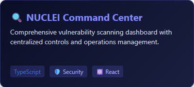
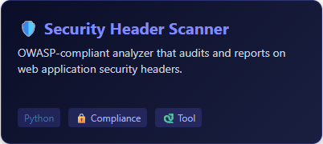
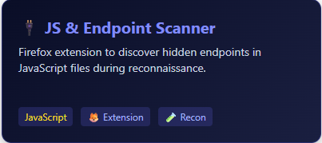
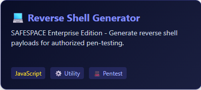

<div align="center">
  
</div>

<!-- Animated Typing Header -->
<h1 align="center">
  <a href="https://git.io/typing-svg">
    
  </a>
</h1>

<div align="center">

  <!-- Badges -->
  <p>
    <a href="https://github.com/devtint">
      
    </a>
    <a href="https://github.com/devtint">
      
    </a>
  </p>

  <!-- Socials -->
  <p>
    <a href="https://tintnaingwin.vercel.app">
      
    </a>
    <a href="https://t.me/BadCodeWriter">
      
    </a>
    <a href="https://github.com/devtint">
      
    </a>
    <!-- Single unobtrusive follower count -->
    <a href="https://github.com/devtint?tab=followers">
      
    </a>
  </p>

</div>

---

## 👨‍💻 About Me

```python
#!/usr/bin/env python3

class SecurityResearcher:
    def __init__(self):
        self.name = "Tyr3ll"
        self.role = "Security Tool Developer"
        self.location = "Bangkok, Thailand"
        self.education = "Digital Technology Innovation @ Kasem Bundit University"
        
        self.languages = ["Python", "TypeScript", "JavaScript"]
        self.interests = ["Vulnerability Research", "Automation", "Web Security"]
        
    def get_current_focus(self):
        return [
            "Building vulnerability scanning tools",
            "Security header analysis automation",
            "Browser extensions for recon",
            "Reverse engineering workflows"
        ]
    
    def life_motto(self):
        return "Break things ethically, build tools obsessively"

me = SecurityResearcher()
```

---

## 🛠️ Tech Arsenal

<div align="center">

### Languages & Runtime


### Frameworks & Tools


### Security Tools


</div>

---

## 🚀 Featured Security Tools

<div align="center">

<a href="https://github.com/devtint/NUCLEI_CNM">
  
</a>
<a href="https://github.com/devtint/SecurityHeaderScanner">
  
</a>

<a href="https://github.com/devtint/Js-And-Endpoints-scanner">
  
</a>
<a href="https://github.com/devtint/r3verse_shells_gen">
  
</a>

</div>

<br/>

<details>
<summary><b>View Project Details</b></summary>

### NUCLEI Command Center
> Comprehensive command center for managing Nuclei vulnerability scans with centralized controls, scan operations, and vulnerability management dashboard.

### Security Header Scanner  
> OWASP-compliant security header analyzer that scans and reports on web application security headers for compliance and best practices.

### JS and Endpoint Scanner
> Firefox extension for security researchers to scan JavaScript files and discover hidden endpoints during web application reconnaissance.

### Reverse Shell Generator
> SAFESPACE Enterprise Edition - Generate reverse shell payloads for various platforms and languages during authorized penetration testing.

</details>

---

## 📈 GitHub Activity

<div align="center">
  
</div>

---

## 🧭 Currently Exploring

<div align="center">

```
+----------------------------------+----------------------------------------+
|          Focus Area              |              Learning                  |
+----------------------------------+----------------------------------------+
|  Advanced Web Security           |  Buffer Overflows, Memory Corruption   |
|  Security Automation             |  CI/CD Security Pipelines              |
|  Vulnerability Research          |  Fuzzing Techniques                    |
|  Tool Development                |  Building Scalable Security Tools      |
+----------------------------------+----------------------------------------+
```

</div>

---

<div align="center">
  
</div>

<div align="center">
  <sub>Building tools to make security testing more efficient, one repo at a time.</sub>
</div>
