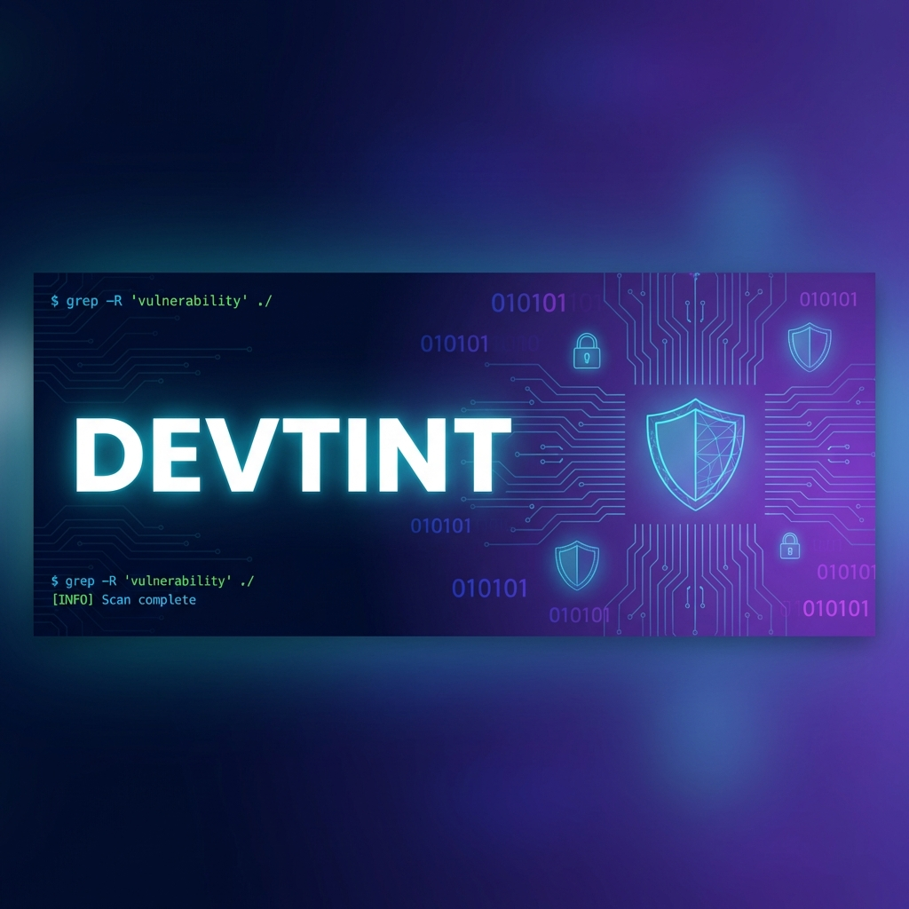

<div align="center">
  
</div>

<!-- Animated Typing Header -->
<h1 align="center">
  <a href="https://git.io/typing-svg">
    
  </a>
</h1>

<p align="center">
  
  
</p>

<p align="center">
  <a href="https://github.com/devtint?tab=followers">
    
  </a>
  
  
</p>

<!-- Social Links -->
<p align="center">
  <a href="https://tintnaingwin.vercel.app">
    
  </a>
  <a href="https://t.me/BadCodeWriter">
    
  </a>
  <a href="https://orcid.org/0009-0007-0176-2022">
    
  </a>
</p>

---

##  About Me

```python
#!/usr/bin/env python3
# -*- coding: utf-8 -*-

class SecurityResearcher:
    def __init__(self):
        self.name = "Tyr3ll"
        self.role = "Security Tool Developer"
        self.location = "Bangkok, Thailand 🇹🇭"
        self.education = "Digital Technology Innovation @ Kasem Bundit University"
        
        self.languages = ["Python", "TypeScript", "JavaScript"]
        self.interests = ["Vulnerability Research", "Automation", "Web Security"]
        
    def get_current_focus(self):
        return [
            "🔍 Building vulnerability scanning tools",
            "🛡️ Security header analysis automation",
            "🔌 Browser extensions for recon",
            "💻 Reverse engineering workflows"
        ]
    
    def life_motto(self):
        return "Break things ethically, build tools obsessively 🔐"

me = SecurityResearcher()
```

---

##  Tech Arsenal

<div align="center">

### 💻 Languages & Runtime


### �️ Frameworks & Tools


### 🔐 Security Tools


</div>

---

##  Featured Security Tools

<table>
<tr>
<td width="50%" valign="top">

### 🔍 [NUCLEI Command Center](https://github.com/devtint/NUCLEI_CNM)
 

> Comprehensive command center for managing Nuclei vulnerability scans with centralized controls, scan operations, and vulnerability management dashboard.

<a href="https://github.com/devtint/NUCLEI_CNM">
  
</a>

</td>
<td width="50%" valign="top">

### 🛡️ [Security Header Scanner](https://github.com/devtint/SecurityHeaderScanner)


> OWASP-compliant security header analyzer that scans and reports on web application security headers for compliance and best practices.

<a href="https://github.com/devtint/SecurityHeaderScanner">
  
</a>

</td>
</tr>
<tr>
<td width="50%" valign="top">

### 🔌 [JS & Endpoint Scanner](https://github.com/devtint/Js-And-Endpoints-scanner)
 

> Firefox extension for security researchers to scan JavaScript files and discover hidden endpoints during web application reconnaissance.

<a href="https://github.com/devtint/Js-And-Endpoints-scanner">
  
</a>

</td>
<td width="50%" valign="top">

### 💻 [Reverse Shell Generator](https://github.com/devtint/r3verse_shells_gen)


> SAFESPACE Enterprise Edition - Generate reverse shell payloads for various platforms and languages during authorized penetration testing.

<a href="https://github.com/devtint/r3verse_shells_gen">
  
</a>

</td>
</tr>
</table>

<div align="center">
  <a href="https://github.com/devtint?tab=repositories">
    
  </a>
</div>

---

##  GitHub Analytics

<div align="center">
  
  
</div>

<div align="center">
  
</div>

<!-- Activity Graph -->
<div align="center">
  
</div>

<!-- GitHub Trophies -->
<div align="center">
  
</div>

---

## 🐍 Contribution Snake

<div align="center">
  <picture>
    <source media="(prefers-color-scheme: dark)" srcset="https://raw.githubusercontent.com/devtint/devtint/output/github-snake-dark.svg" />
    <source media="(prefers-color-scheme: light)" srcset="https://raw.githubusercontent.com/devtint/devtint/output/github-snake.svg" />
    
  </picture>
</div>

---

## 🌱 Currently Exploring

<div align="center">

| 🎯 Focus Area | 📚 Learning |
|:---:|:---:|
| 🔐 Advanced Web Security | Buffer Overflows & Memory Corruption |
| 🤖 Security Automation | CI/CD Security Pipelines |
| 🧪 Vulnerability Research | Fuzzing Techniques |
| � Mobile Security | APK Reverse Engineering |

</div>

---

## 📫 Let's Connect!

<div align="center">

<a href="https://tintnaingwin.vercel.app">
  
</a>
<a href="https://t.me/BadCodeWriter">
  
</a>
<a href="https://github.com/devtint">
  
</a>

</div>

---

<div align="center">
  
### 💭 Random Dev Quote
  


</div>

---

<div align="center">
  
</div>

<div align="center">
  <sub>⚡ Building tools to make security testing more efficient, one repo at a time.</sub>
</div>
